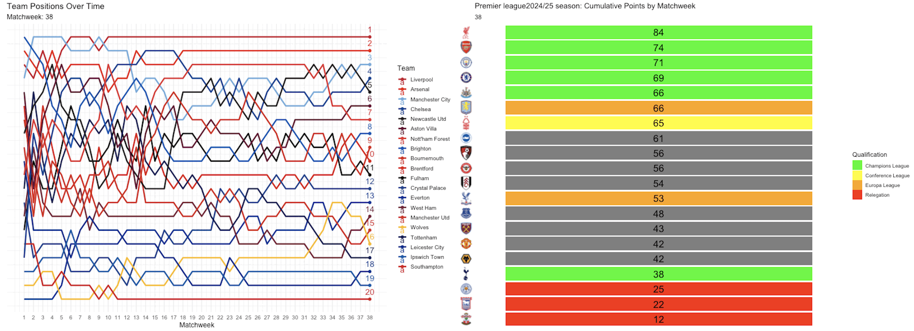
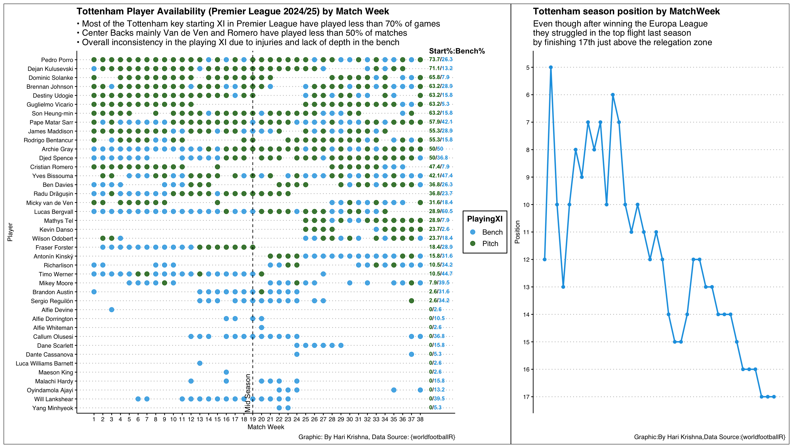
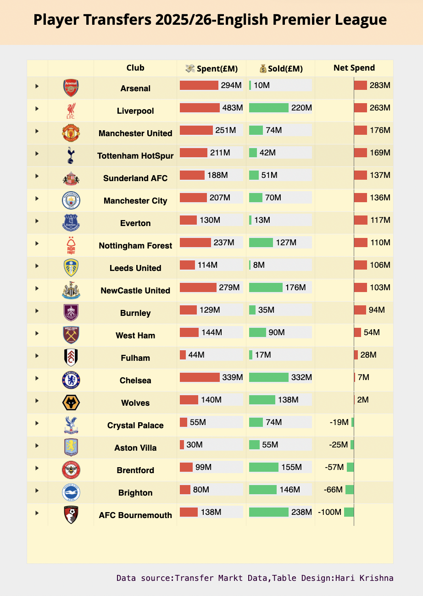

# Football-Viz

## Idea of combining soccer data with amazing visualizations

1.**Liverpool Analysis 2024-25 Premier League season Visual Info graphic**

-   Liverpool Formations

-   Goals scored by Time Ranges

-   Top Goal scorers in 2024/25 season

-   Salah scoring by Team/Match Week

2.  **Premier League 2024/25 Season using {gganimate}**

-   Team Positions by match week to be displayed

-   Points by match day

-   2 Visuals for the season 24/25

3.  **Tottenham Premier League 2024/25 season player availability analysis**

-   Analyze the player availability of Tottenham by Match Week for 2024/25 Premier league season

-   See the league positions across 38 weeks

4.  **Transfer Analysis 2025/26 Premier League : Posit Table contest 2025**

